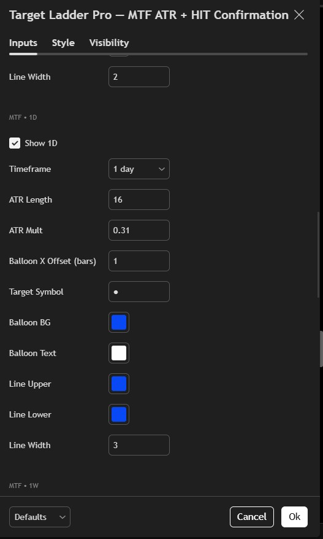
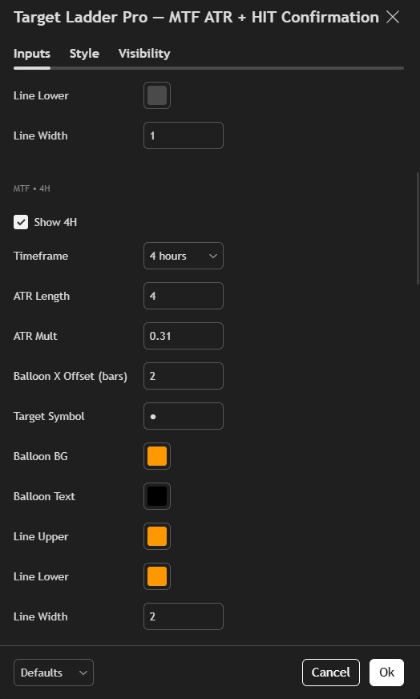
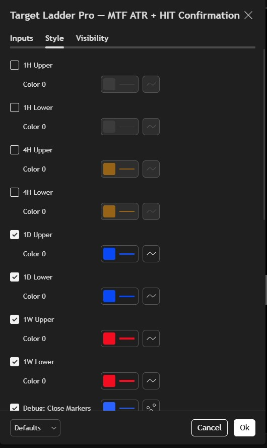
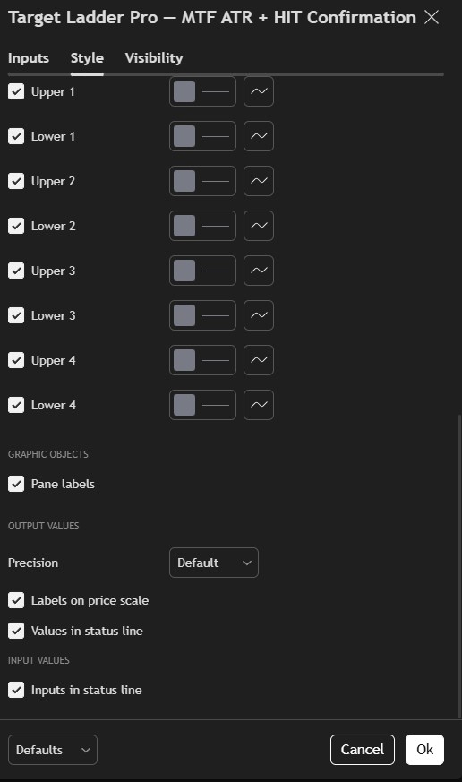

# Infinity Signal Indicators

This repository contains free TradingView (Pine Script) indicators created by **Jerome Morrow**  
(TradingView: **Dinjin**).

These tools are designed to visualize market structure, timing, and volatility context.
They are **not trading strategies** and do not generate buy or sell signals.

---

## My Preferred Settings (Used in the Video)

Target Ladder Pro is highly configurable and includes many optional settings.
To avoid overwhelming users, the images below show the **exact configuration used in the demonstration video**.

These screenshots are provided purely as a **reference baseline** — they are not required, not optimal, and not intended as prescriptive settings.

---

### Settings Snapshot 1

---

### Settings Snapshot 2

---

### Settings Snapshot 3

---

### Settings Snapshot 4

---

### Settings Snapshot 5

---

### Settings Snapshot 6

---

### Settings Snapshot 7

---

### Settings Snapshot 8

---

### Settings Snapshot 9

---

### Notes

- These screenshots reflect **one complete configuration**, not a recommended or “best” setup.
- ATR-based levels are **volatility references**, not forecasts.
- HIT labels indicate that a defined volatility condition occurred; they do not imply direction.
- Different assets and regimes may require different settings.

---

## License
Released under the MIT License.  
Free to use, modify, and share.

Educational use only. Not financial advice.
